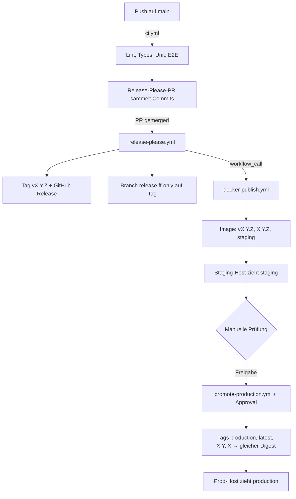

# Release-Pipeline

Vom Commit auf `main` bis zum Container auf Production. Leitprinzip: **einmal
bauen, Artefakt weiterreichen.** Das Image, das auf Production läuft, ist
bitgleich mit dem, das auf Staging getestet wurde — Promotion hängt nur Tags um,
sie baut nichts neu.

---

## Überblick



---

## Image-Tags

| Tag                  | Wird gesetzt von                       | Bedeutung                                                       |
| -------------------- | -------------------------------------- | --------------------------------------------------------------- |
| `vX.Y.Z`, `X.Y.Z`    | `docker-publish.yml` beim Release      | Unveränderlich. Zeigt für immer auf denselben Digest.           |
| `staging`            | `docker-publish.yml` beim Release      | Neuestes Release, **ungeprüft**. Staging-Host folgt diesem Tag. |
| `production`         | `promote-production.yml` nach Freigabe | Freigegebener Stand. Prod-Host folgt diesem Tag.                |
| `latest`, `X.Y`, `X` | `promote-production.yml` nach Freigabe | Bequemlichkeits-Zeiger auf den Production-Stand.                |

**Wichtig:** `latest` bewegt sich seit dieser Pipeline **nicht mehr beim Build**,
sondern erst bei der Production-Freigabe. Vorher stand jedes frische Release
sofort auf `latest` — ein Host, der `latest` zieht, hätte das Staging damit
komplett übersprungen.

---

## Die vier Stufen

### 1. Push auf `main`

`ci.yml` läuft. Es wird kein Image gebaut und nichts deployt. Für lokale
Entwicklung `npm run dev`.

### 2. Release-PR mergen

`release-please.yml` erledigt drei Dinge:

- Tag `vX.Y.Z` + GitHub Release + `CHANGELOG.md`
- Branch `release` per `git merge --ff-only` auf den Tag (Fast-Forward, kein
  Force-Push — ein Direkt-Commit auf `release` lässt den Job laut fehlschlagen,
  statt still überschrieben zu werden)
- Aufruf von `docker-publish.yml` per `workflow_call` (Job `docker-publish`)

> Warum ein Aufruf und kein eigener Trigger: Tags und Pushes, die mit
> `GITHUB_TOKEN` entstehen, starten **keine** Workflow-Läufe. Ein
> `on: push: tags: ['v*']` in `docker-publish.yml` feuert für ein
> release-please-Tag also nie. Über `workflow_call` hängt der Build zusätzlich
> in derselben `needs`-Kette — schlägt er fehl, ist der Release-Lauf rot statt
> grün mit stillem Fehler nebenan.
>
> Der `push: tags`-Trigger in `docker-publish.yml` bleibt trotzdem bestehen —
> er greift für von Hand gepushte Tags.

### 3. Build + Staging

`docker-publish.yml` baut Multi-Arch (amd64 + arm64), pusht nach GHCR, scannt
mit Trivy und hängt die Deployment-Assets ans Release. Danach steht `staging`
auf dem neuen Digest, und der Staging-Host zieht beim nächsten Lauf.

### 4. Production-Freigabe

Manuell: **Actions → Promote to Production → Run workflow**, Version eintragen
(`v2.5.6`). Der Job hängt am GitHub-Environment `Production` und wartet auf die
Freigabe der dort hinterlegten Reviewer.

Der Workflow prüft, dass der Versions-Tag existiert, warnt wenn `staging` auf
etwas anderes zeigt (Rollback bleibt trotzdem möglich), hängt die
Production-Tags um und verifiziert danach, dass `production` wirklich auf dem
erwarteten Digest steht.

---

## Host-Setup (pull-basiert)

Beide Hosts holen sich das Image selbst ab. GitHub Actions braucht **keinen**
Zugriff auf die Server, es bewegt nur Tags in der Registry — keine SSH-Keys als
Repo-Secrets, keine offenen Ports für CI.

Production nutzt `docker-compose.production.yml` aus diesem Repo. **hawking
nicht** — dort liegt eine eigene, handgepflegte `docker-compose.yml` ohne
`db`-Service (PostgreSQL läuft nativ auf dem Host, nicht containerisiert).
Details, Architektur-Unterschiede und ein aktueller Vorfall dazu:
[PREPROD_HAWKING.md](./PREPROD_HAWKING.md).

### Staging (hawking)

Tatsächlicher Stand (per SSH verifiziert, 2026-09-13 — dieser Abschnitt war
zuvor aspirational und beschrieb einen nie umgesetzten Plan):

```bash
# /opt/ostsee-tiere/.env   (NICHT /opt/ostsee-staging — der Pfad ist historisch
#                            gewachsen und wurde nie auf den unten genannten
#                            Plan umgezogen)
IMAGE_TAG=staging
# COMPOSE_PROJECT_NAME ist nicht gesetzt — Compose leitet den Projektnamen aus
# dem Verzeichnisnamen ab, hier also ebenfalls "ostsee-tiere".
PUBLIC_SITE_URL=https://preprod.ostsee-tiere.de
```

**Kein Pull-Timer eingerichtet.** `IMAGE_TAG=staging` ist gesetzt, aber es
zieht niemand automatisch neue Images — weder Cron noch systemd-Timer.
`docker compose pull && docker compose up -d` läuft nur von Hand. Ein
Update-Lauf wie unten für Production wäre hierfür ebenso denkbar, ist aber
(Stand 2026-09-13) nicht eingerichtet.

### Production (Hetzner)

```bash
# /opt/ostsee-tiere/.env
IMAGE_TAG=production
COMPOSE_PROJECT_NAME=ostsee-tiere
PUBLIC_SITE_URL=https://ostsee-tiere.example.com
```

> `ORIGIN` gehört hier **nicht** hinein: Die Compose-Datei reicht die Variable
> nicht an den Container weiter, der Eintrag wäre wirkungslos. Den Origin
> bestimmt der adapter-node aus `PROTOCOL_HEADER`/`HOST_HEADER` (Default in der
> Compose-Datei), sonst aus dem `Host`-Header.

### Suchmaschinen: nur die kanonische Domain

Beide Hosts fahren dasselbe Image mit `NODE_ENV=production` — eine statische
`robots.txt` läge auf Staging und Production identisch, und der Staging-Host
wäre indexierbar. Deshalb erzeugt `src/routes/robots.txt/+server.ts` den Inhalt
**pro Anfrage-Host**:

| Host                                                 | `/robots.txt`         | `/sitemap.xml` |
| ---------------------------------------------------- | --------------------- | -------------- |
| `ostsee-tiere.de`, `www.ostsee-tiere.de`             | Freigabe + Sperrliste | 200            |
| alles andere (Staging, Vorschau, roher Hostname, IP) | `Disallow: /`         | 404            |

**Kommt eine weitere öffentliche Domain dazu**, gehört sie in
`KANONISCHE_HOSTS` in `src/lib/seo/robotsTxt.ts` — sonst liefert sie
`Disallow: /` aus und verschwindet aus dem Suchindex. Die Liste steht bewusst
im Code und nicht in einer Umgebungsvariablen: Der Production-Host läuft mit
einem eigenen Compose-Stand, den dieses Repository nicht ändert, eine neue
Variable bliebe dort still ungesetzt.

Ob KI-Crawler (GPTBot, ClaudeBot, CCBot, Google-Extended, PerplexityBot)
zugreifen dürfen, ist eine Entscheidung des Museums und steht dort als fertiger,
auskommentierter Block bereit. Zugelassen ist derzeit alles — das war der
Zustand vor Einführung der Datei.

Auf Production **vor** dem Update sichern — die Schema-Migrationen des neuen
Release laufen beim Container-Start automatisch und sind nicht rückrollbar:

```bash
#!/usr/bin/env bash
set -euo pipefail
cd /opt/ostsee-tiere

# Image-ID des laufenden Containers. `.Image` ist am Container die ID des
# Images, mit dem er gestartet wurde — NICHT .RepoDigests, das gibt es nur
# am Image-Objekt und wäre hier leer.
RUNNING=$(docker inspect --format '{{.Image}}' \
  "$(docker compose ps -q app)" 2>/dev/null || echo none)

docker compose pull --quiet
PULLED=$(docker image inspect --format '{{.Id}}' \
  ghcr.io/jansinger/ostsee-tiere:production)

if [ "$RUNNING" = "$PULLED" ]; then
  exit 0
fi

# backup.sh wird beim Server-Setup angelegt, siehe
# PRODUCTION_DEPLOYMENT.md Abschnitt 8 (Backup einrichten).
/opt/ostsee-tiere/backup.sh
docker compose up -d
```

Ein Timer alle 5 Minuten reicht; der ID-Vergleich macht die Läufe dazwischen zu
No-ops. Wer den Moment lieber selbst bestimmt, lässt den Timer weg und ruft das
Skript nach der Freigabe von Hand auf.

---

## Zwei Dinge, die getrennt sein müssen

**Datenbanken.** Staging und Production brauchen jeweils eine eigene DB.
Migrationen laufen beim Container-Start — bei geteilter DB migriert das
Staging-Deploy die Produktion, und die Freigabe sichert nichts mehr ab.

**Upload-Verzeichnisse.** Jeder Stack braucht sein eigenes `uploads/`-Volume.
Medien liegen seit dem 28.07.2026 auf Platte statt in Vercel Blob; ein geteiltes
Volume würde Staging-Testdaten in den Prod-Bestand schreiben.

Ein dritter Punkt stand hier bis zum Session-Store: `SESSION_SECRET` musste je Stack
verschieden sein, sonst war ein Staging-Zugang ein Produktions-Zugang. Die Variable
existiert nicht mehr — Sessions liegen in der Datenbank, und die ist nach dem ersten Punkt
ohnehin getrennt. Der Punkt ist damit nicht weggefallen, sondern im ersten aufgegangen.

---

## Rollback

Da alle Versions-Tags unveränderlich sind, ist der Rückweg dieselbe Aktion mit
einer älteren Version:

**Actions → Promote to Production → Run workflow → `v2.5.5`**

Der Workflow warnt, dass `staging` auf etwas Neueres zeigt, und macht trotzdem
weiter. Der Prod-Host zieht beim nächsten Lauf zurück.

**Grenze:** Das rollt den _Code_ zurück, nicht das _Schema_. Enthielt das
fehlerhafte Release eine destruktive Migration, muss die DB aus dem Backup
zurückgeholt werden, das `backup.sh` vor dem Update gezogen hat. Deshalb steht
der Backup-Schritt im Prod-Skript vor `docker compose up -d`.

---

## Einmaliges Setup

- [x] GitHub-Environment `Production` mit _Required reviewers_ — vorhanden
      (Stand 29.07.2026: Reviewer `jansinger`). Referenziert der Workflow eine
      nicht existierende Environment, legt GitHub sie beim ersten Lauf **ohne**
      Schutzregeln an und die Promotion läuft still ohne Rückfrage durch.
- [ ] `promote-production.yml` muss auf `main` liegen, sonst taucht
      _Run workflow_ nicht in der Actions-UI auf (`workflow_dispatch` wird nur
      vom Default-Branch gelesen)
- [x] Staging-Host (hawking): Stack mit `IMAGE_TAG=staging`, eigener DB
      (nativ, kein `db`-Container) und eigenem `uploads`-Volume — allerdings
      unter `/opt/ostsee-tiere`, nicht `/opt/ostsee-staging` wie ursprünglich
      hier geplant. Siehe [PREPROD_HAWKING.md](./PREPROD_HAWKING.md).
- [ ] Prod-Host: `IMAGE_TAG` in der bestehenden `.env` auf `production` setzen
      (oder digest-genau per `APP_IMAGE=…@sha256:…`, das Vorrang hat)
      (bisheriger Default war `latest`)
- [ ] Beide Hosts: `docker login ghcr.io` mit einem Read-Token, falls das
      Package privat ist
- [ ] Pull-Timer auf beiden Hosts einrichten — auf hawking (Stand 2026-09-13)
      noch nicht vorhanden, Updates laufen dort ausschließlich manuell

---

## Verwandte Dokumente

| Dokument                                               | Inhalt                                   |
| ------------------------------------------------------ | ---------------------------------------- |
| [PRODUCTION_DEPLOYMENT.md](./PRODUCTION_DEPLOYMENT.md) | Server einrichten, Reverse Proxy, Backup |
| [DOCKER_DEPLOYMENT.md](./DOCKER_DEPLOYMENT.md)         | Vollständige Docker-Referenz             |
| [ENVIRONMENT.md](./ENVIRONMENT.md)                     | Umgebungsvariablen                       |
| [DATABASE_MIGRATION.md](./DATABASE_MIGRATION.md)       | Schema-Migrationen                       |
